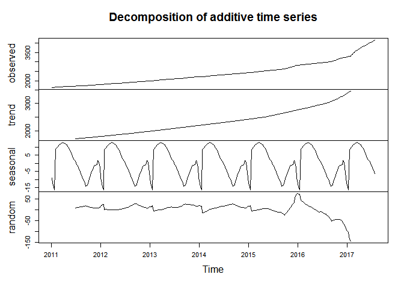

Forecasts of official USD exchange rates in Uzbekistan
================

Observed values of USD
----------------------

The following graph depicts observed values of USD over the period from 2011-01-04 to 2017-08-15.

Prognosticated values of USD
----------------------------

The following graph depicts forecasted values of USD for 40 weeks.

Forecasted official USD exchange rates for 40 weeks

    ##          Point Forecast    Lo 80    Hi 80    Lo 95    Hi 95
    ## 2017.601       4182.280 4176.613 4187.955 4173.616 4190.962
    ## 2017.620       4210.240 4198.086 4222.430 4191.666 4228.897
    ## 2017.639       4238.245 4218.666 4257.915 4208.338 4268.364
    ## 2017.658       4266.367 4238.710 4294.204 4224.142 4309.014
    ## 2017.678       4294.508 4258.300 4331.024 4239.256 4350.481
    ## 2017.697       4322.780 4277.664 4368.372 4253.972 4392.701
    ## 2017.716       4352.900 4298.580 4407.908 4270.099 4437.307
    ## 2017.735       4383.172 4319.418 4447.866 4286.046 4482.499
    ## 2017.754       4413.480 4340.106 4488.095 4301.759 4528.103
    ## 2017.773       4443.956 4360.796 4528.701 4317.406 4574.214
    ## 2017.793       4474.540 4381.450 4569.607 4332.958 4620.747
    ## 2017.812       4505.304 4402.149 4610.877 4348.501 4667.761
    ## 2017.831       4536.255 4422.905 4652.509 4364.052 4715.252
    ## 2017.850       4567.396 4443.726 4694.507 4379.620 4763.222
    ## 2017.869       4598.732 4464.617 4736.876 4395.212 4811.676
    ## 2017.888       4629.606 4484.941 4778.937 4410.199 4859.928
    ## 2017.908       4660.665 4505.326 4821.360 4425.202 4908.658
    ## 2017.927       4691.926 4525.785 4864.166 4440.230 4957.890
    ## 2017.946       4723.176 4546.109 4907.140 4455.079 5007.407
    ## 2017.965       4754.057 4565.953 4949.911 4469.408 5056.835
    ## 2017.984       4784.731 4585.470 4992.651 4483.369 5106.349
    ## 2018.003       4816.006 4605.432 5036.208 4497.714 5156.823
    ## 2018.023       4848.466 4626.389 5081.202 4512.976 5208.895
    ## 2018.042       4881.172 4647.437 5126.662 4528.270 5261.575
    ## 2018.061       4914.050 4668.501 5172.515 4543.522 5314.796
    ## 2018.080       4947.164 4689.636 5218.833 4558.781 5368.634
    ## 2018.099       4984.962 4715.047 5270.328 4578.130 5427.946
    ## 2018.118       5022.950 4740.460 5322.274 4597.408 5487.880
    ## 2018.138       5061.198 4765.937 5374.752 4616.673 5548.526
    ## 2018.157       5099.615 4791.387 5427.671 4635.835 5609.792
    ## 2018.176       5138.284 4816.886 5481.127 4654.968 5671.783
    ## 2018.195       5177.004 4842.242 5534.910 4673.883 5734.284
    ## 2018.214       5213.466 4865.296 5586.551 4690.500 5794.740
    ## 2018.233       5250.090 4888.316 5638.638 4707.008 5855.831
    ## 2018.253       5287.010 4911.422 5691.319 4723.522 5917.717
    ## 2018.272       5324.055 4934.453 5744.418 4739.887 5980.219
    ## 2018.291       5361.514 4957.673 5798.251 4756.355 6043.668
    ## 2018.310       5399.489 4981.172 5852.937 4773.011 6108.196
    ## 2018.329       5436.846 5003.901 5907.250 4788.849 6172.526
    ## 2018.348       5475.251 5027.393 5963.005 4805.337 6238.558
