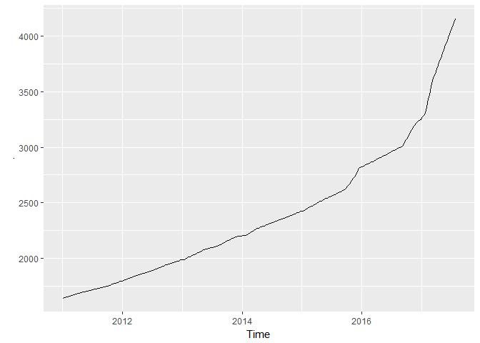

Forecasts of official USD exchange rates in Uzbekistan
================

Observed values of USD
----------------------

The following graph depicts observed values over the period from 2011-01-04 to 2017-08-01.

Prognosticated values of USD
----------------------------

The following graph depicts forecasted values for 40 weeks.

Forecasted official USD exchange rates for 40 weeks

    ##          Point Forecast    Lo 80    Hi 80    Lo 95    Hi 95
    ## 2017.567       4126.230 4120.622 4131.845 4117.657 4134.820
    ## 2017.586       4154.114 4142.088 4166.176 4135.735 4172.575
    ## 2017.605       4182.015 4162.641 4201.478 4152.422 4211.818
    ## 2017.625       4209.959 4182.593 4237.505 4168.178 4252.159
    ## 2017.644       4237.952 4202.124 4274.086 4183.280 4293.339
    ## 2017.663       4266.066 4221.423 4311.181 4197.980 4335.257
    ## 2017.682       4294.202 4240.473 4348.613 4212.303 4377.694
    ## 2017.701       4322.472 4259.437 4386.439 4226.441 4420.684
    ## 2017.721       4352.590 4280.040 4426.369 4242.126 4465.931
    ## 2017.740       4382.861 4300.634 4466.661 4257.732 4511.668
    ## 2017.759       4413.171 4321.123 4507.181 4273.175 4557.754
    ## 2017.778       4443.650 4341.646 4548.051 4288.600 4604.307
    ## 2017.797       4474.239 4362.153 4589.205 4303.960 4651.256
    ## 2017.816       4505.010 4382.717 4630.715 4319.329 4698.673
    ## 2017.836       4535.967 4403.344 4672.585 4334.714 4746.564
    ## 2017.855       4567.116 4424.038 4714.822 4350.120 4794.936
    ## 2017.874       4598.461 4444.800 4757.434 4365.547 4843.801
    ## 2017.893       4629.345 4464.996 4799.743 4380.370 4892.471
    ## 2017.912       4660.415 4485.247 4842.424 4395.200 4941.633
    ## 2017.932       4691.687 4505.566 4885.496 4410.047 4991.313
    ## 2017.951       4722.949 4525.744 4928.746 4424.706 5041.294
    ## 2017.970       4753.842 4545.438 4971.803 4438.839 5091.200
    ## 2017.989       4784.530 4564.799 5014.838 4452.595 5141.210
    ## 2018.008       4815.819 4584.596 5058.703 4466.723 5192.199
    ## 2018.027       4848.292 4605.375 5104.021 4481.749 5244.812
    ## 2018.047       4881.011 4626.237 5149.816 4496.796 5298.054
    ## 2018.066       4913.904 4647.109 5196.015 4511.791 5351.855
    ## 2018.085       4947.031 4668.045 5242.692 4526.785 5406.292
    ## 2018.104       4984.840 4693.226 5294.573 4545.826 5466.252
    ## 2018.123       5022.839 4718.403 5346.917 4564.786 5526.855
    ## 2018.142       5061.099 4743.638 5399.806 4583.726 5588.188
    ## 2018.162       5099.527 4768.840 5453.146 4602.556 5650.161
    ## 2018.181       5138.209 4794.085 5507.034 4621.347 5712.877
    ## 2018.200       5176.941 4819.182 5561.259 4639.915 5776.123
    ## 2018.219       5213.417 4841.985 5613.342 4656.196 5837.323
    ## 2018.238       5250.056 4864.749 5665.881 4672.362 5899.177
    ## 2018.258       5286.991 4887.594 5719.026 4688.529 5961.845
    ## 2018.277       5324.053 4910.361 5772.598 4704.541 6025.144
    ## 2018.296       5361.527 4933.310 5826.915 4720.649 6089.412
    ## 2018.315       5399.518 4956.533 5882.095 4736.938 6154.778
