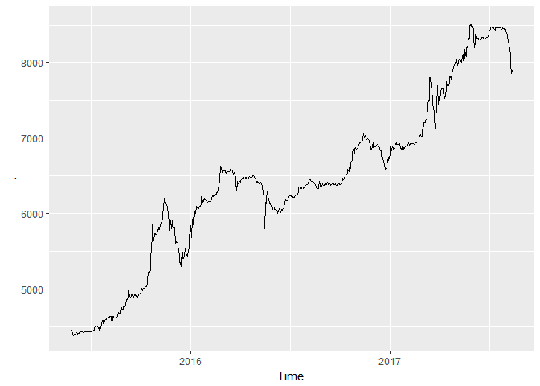
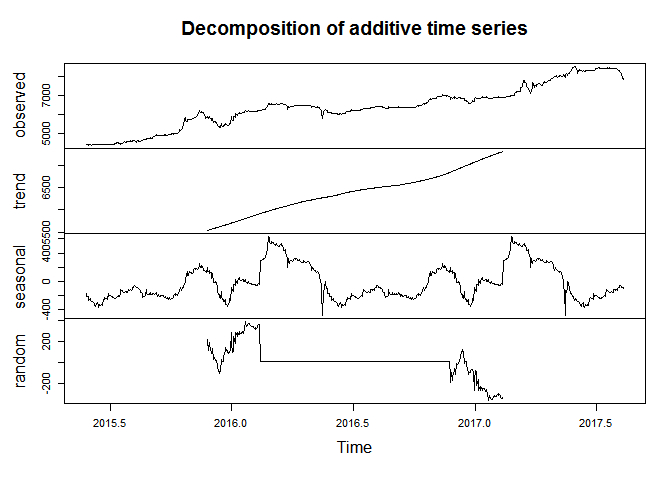
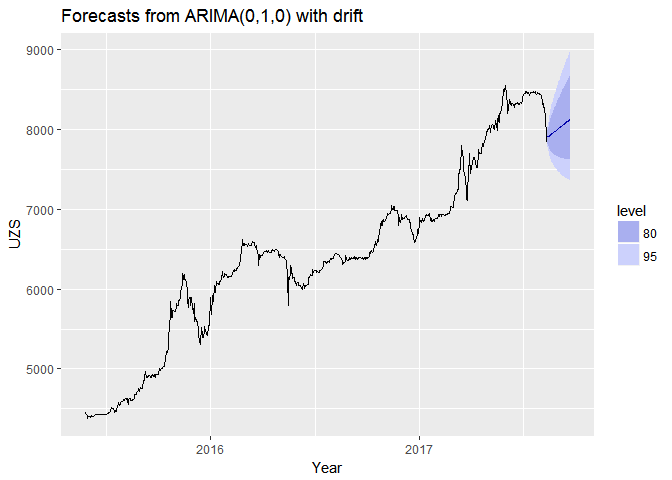

Forecasts of market USD exchange rates in Uzbekistan
================

Observed values of USD
----------------------

The following graph depicts observed values over the period from 2015-05-27 to 2017-08-12 18:17:53:

Prognosticated values of USD
----------------------------

The following graph depicts forecasted values for 40 weeks:

    ## Series: currency 
    ## ARIMA(0,1,0)             with drift         
    ## Box Cox transformation: lambda= 0 
    ## 
    ## Coefficients:
    ##       drift
    ##       7e-04
    ## s.e.  3e-04
    ## 
    ## sigma^2 estimated as 6.418e-05:  log likelihood=2754.67
    ## AIC=-5505.34   AICc=-5505.33   BIC=-5495.95
    ## 
    ## Training set error measures:
    ##                      ME     RMSE      MAE        MPE      MAPE       MASE
    ## Training set -0.2336614 50.75067 29.05642 -0.0021509 0.4540232 0.01996256
    ##                     ACF1
    ## Training set -0.01397655

Forecasted market USD exchange rates for 40 weeks:

    ##           Point Forecast    Lo 80    Hi 80    Lo 95    Hi 95
    ## 2017.6149       7905.614 7824.861 7987.199 7782.448 8030.728
    ## 2017.6177       7911.231 7797.192 8026.939 7737.490 8088.875
    ## 2017.6204       7916.853 7777.311 8058.898 7704.441 8135.122
    ## 2017.6231       7922.479 7761.456 8086.842 7677.545 8175.226
    ## 2017.6259       7928.109 7748.169 8112.226 7654.575 8211.417
    ## 2017.6286       7933.742 7736.704 8135.799 7634.387 8244.836
    ## 2017.6313       7939.380 7726.616 8158.002 7616.304 8276.160
    ## 2017.6341       7945.022 7717.619 8179.125 7599.886 8305.831
    ## 2017.6368       7950.667 7709.510 8199.368 7584.824 8334.156
    ## 2017.6396       7956.317 7702.145 8218.877 7570.898 8361.357
    ## 2017.6423       7961.971 7695.414 8237.761 7557.939 8387.602
    ## 2017.6450       7967.629 7689.231 8256.106 7545.815 8413.021
    ## 2017.6478       7973.290 7683.528 8273.980 7534.424 8437.720
    ## 2017.6505       7978.956 7678.251 8291.438 7523.682 8461.780
    ## 2017.6533       7984.626 7673.353 8308.525 7513.518 8485.273
    ## 2017.6560       7990.300 7668.799 8325.279 7503.876 8508.254
    ## 2017.6587       7995.978 7664.555 8341.732 7494.707 8530.775
    ## 2017.6615       8001.660 7660.594 8357.911 7485.969 8552.875
    ## 2017.6642       8007.346 7656.892 8373.839 7477.626 8574.591
    ## 2017.6669       8013.036 7653.430 8389.538 7469.646 8595.955
    ## 2017.6697       8018.730 7650.189 8405.024 7462.002 8616.993
    ## 2017.6724       8024.428 7647.154 8420.315 7454.671 8637.730
    ## 2017.6752       8030.130 7644.310 8435.423 7447.630 8658.188
    ## 2017.6779       8035.836 7641.645 8450.361 7440.861 8678.385
    ## 2017.6806       8041.546 7639.148 8465.142 7434.347 8698.339
    ## 2017.6834       8047.261 7636.808 8479.773 7428.071 8718.064
    ## 2017.6861       8052.979 7634.617 8494.266 7422.021 8737.575
    ## 2017.6888       8058.701 7632.567 8508.628 7416.183 8756.885
    ## 2017.6916       8064.428 7630.649 8522.866 7410.547 8776.005
    ## 2017.6943       8070.158 7628.857 8536.987 7405.100 8794.946
    ## 2017.6971       8075.893 7627.185 8550.999 7399.835 8813.717
    ## 2017.6998       8081.632 7625.626 8564.906 7394.741 8832.327
    ## 2017.7025       8087.374 7624.176 8578.714 7389.812 8850.784
    ## 2017.7053       8093.121 7622.830 8592.427 7385.038 8869.096
    ## 2017.7080       8098.872 7621.582 8606.052 7380.414 8887.270
    ## 2017.7107       8104.627 7620.430 8619.591 7375.933 8905.312
    ## 2017.7135       8110.386 7619.367 8633.048 7371.588 8923.229
    ## 2017.7162       8116.150 7618.392 8646.429 7367.375 8941.026
    ## 2017.7190       8121.917 7617.501 8659.734 7363.287 8958.708
    ## 2017.7217       8127.688 7616.690 8672.969 7359.320 8976.280
